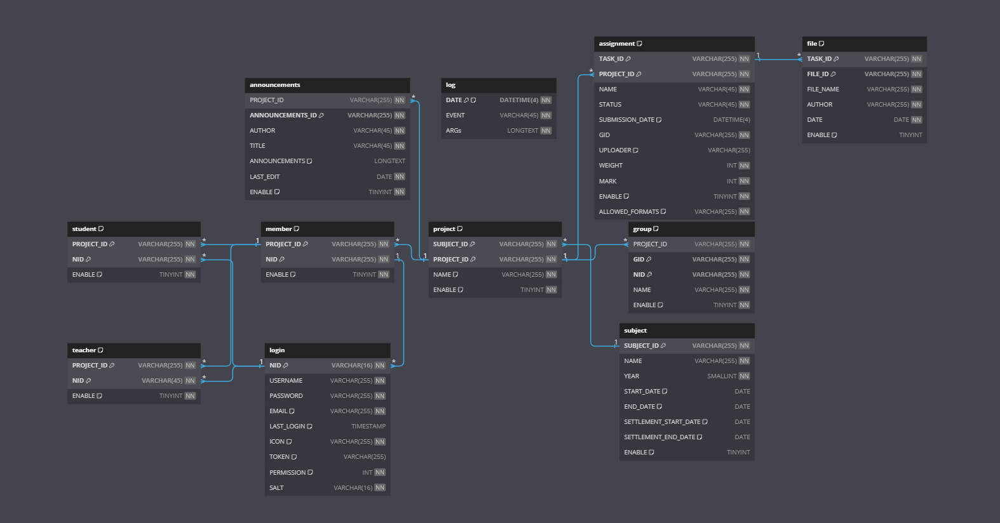

# 逢甲大學專題管理系統

# Docker environment

> The following environment variables edit the default setting of [setting.json](#settingjson) file
> The following environment variables can be edit in [docker-compose.yaml](../docker-compose.yaml)

| Environment variables | Default setting                | Description                                              |
| --------------------- | ------------------------------ | -------------------------------------------------------- |
| DATABASE              | PMS                            | mysql schema name                                        |
| HOST                  | localhost                      | mysql database host address should be internal docker ip |
| USER                  | root                           | mysql username                                           |
| PASSWORD              | Abc!@#$%^&\*()                 | mysql password                                           |
| JWT_SECRET            | May be this is a secret string | Json Web Token secret                                    |
| JWT_TOKEN_EXPIRE_TIME | 3600                           | Json Web Token expiration time                           |

# setting.json

> Setting of setting.json
> setting.json includes all the permission setting, database setting, JSON Web token setting and CORS settings

`The default setting of setting.json file`

| class       | subclass              | datatype | default                                      | description                                   |
| ----------- | --------------------- | -------- | -------------------------------------------- | --------------------------------------------- |
| debug       |                       | boolean  | false                                        | enable if in development state                |
| permissions |                       |          |                                              | setting of [handler.py](./backend/handler.py) |
|             | login                 | integer  | 0                                            | login function                                |
|             | logout                | integer  | 0                                            | logout function                               |
|             | JWTValidation         | integer  | 0                                            | JWTValidation function                        |
|             | checkPermission       | integer  | 0                                            | checkPermission function                      |
|             | getPermissionLevel    | integer  | 0                                            | getPermissionLevel function                   |
|             | TimeoutStatus         | integer  | 0                                            | TimeoutStatus function                        |
|             | changePassword        | integer  | 0                                            | changePassword function                       |
|             | getIconImages         | integer  | 0                                            | getIconImages function                        |
|             | changeIcon            | integer  | 0                                            | changeIcon function                           |
|             | getDeadlineProject    | integer  | 1                                            | getDeadlineProject function                   |
|             | getAboutPage          | integer  | 1                                            | getAboutPage function                         |
|             | getSubject            | integer  | 1                                            | getSubject function                           |
|             | getProject            | integer  | 1                                            | getProject function                           |
|             | getProjectInfo        | integer  | 1                                            | getProjectInfo function                       |
|             | getStudentData        | integer  | 1                                            | getStudentData function                       |
|             | getStudentList        | integer  | 1                                            | getStudentList function                       |
|             | getStudentInfo        | integer  | 1                                            | getStudentInfo function                       |
|             | getTeacherData        | integer  | 1                                            | getTeacherData function                       |
|             | getTeacherList        | integer  | 1                                            | getTeacherList function                       |
|             | getTeacherInfo        | integer  | 1                                            | getTeacherInfo function                       |
|             | getAnnouncementData   | integer  | 1                                            | getAnnouncementData function                  |
|             | getAnnouncementInfo   | integer  | 1                                            | getAnnouncementInfo function                  |
|             | getGroupData          | integer  | 1                                            | getGroupData function                         |
|             | getGroupTeacherData   | integer  | 1                                            | getGroupTeacherData function                  |
|             | getGroupStudentData   | integer  | 1                                            | getGroupStudentData function                  |
|             | getGroupInfo          | integer  | 1                                            | getGroupInfo function                         |
|             | getAssignment         | integer  | 1                                            | getAssignment function                        |
|             | downloadAssignment    | integer  | 1                                            | downloadAssignment function                   |
|             | uploadAssignment      | integer  | 1                                            | uploadAssignment function                     |
|             | deleteAssignment      | integer  | 1                                            | deleteAssignment function                     |
|             | deleteAssignmentItem  | integer  | 1                                            | deleteAssignmentItem function                 |
|             | getAssignmentInfo     | integer  | 1                                            | getAssignmentInfo function                    |
|             | createSubject         | integer  | 2                                            | createSubject function                        |
|             | deleteSubject         | integer  | 2                                            | deleteSubject function                        |
|             | createProject         | integer  | 2                                            | createProject function                        |
|             | deleteProject         | integer  | 2                                            | deleteProject function                        |
|             | newStudent            | integer  | 2                                            | newStudent function                           |
|             | deleteStudent         | integer  | 2                                            | deleteStudent function                        |
|             | importStudent         | integer  | 2                                            | importStudent function                        |
|             | newTeacher            | integer  | 2                                            | newTeacher function                           |
|             | deleteTeacher         | integer  | 2                                            | deleteTeacher function                        |
|             | importTeacher         | integer  | 2                                            | importTeacher function                        |
|             | createAnnouncement    | integer  | 2                                            | createAnnouncement function                   |
|             | deleteAnnouncement    | integer  | 2                                            | deleteAnnouncement function                   |
|             | newGroup              | integer  | 2                                            | newGroup function                             |
|             | getGroupToken         | integer  | 2                                            | getGroupToken function                        |
|             | deleteGroup           | integer  | 2                                            | deleteGroup function                          |
|             | markAssignmentScore   | integer  | 2                                            | markAssignmentScore function                  |
|             | newAssignment         | integer  | 2                                            | newAssignment function                        |
|             | getLog                | integer  | 3                                            | getLog function                               |
|             | forceChangePassword   | integer  | 3                                            | forceChangePassword function                  |
|             | importUsers           | integer  | 3                                            | importUsers function                          |
| database    |                       |          |                                              | setting of [setup.py](./backend/setup.py)     |
|             | DATABASE              | string   | PMS                                          | database schema name                          |
|             | HOST                  | string   | localhost                                    | MYSQL host ip address                         |
|             | USER                  | string   | root                                         | MYSQL username                                |
|             | PASSWORD              | string   | Abc!@#$%^&\*()                               | MYSQL password                                |
| JWT         |                       |          |                                              | setting of JSON Web Token                     |
|             | JWT_TOKEN_EXPIRE_TIME | integer  | 3600                                         | JSON Web Token expire time                    |
|             | JWT_SECRET            | string   | May be this is a secret string               | JSON Web Token secret                         |
|             | JWT_ALGORITHM         | string   | HS256                                        | JSON Web Token encrypt algorithm              |
| CORS        |                       |          |                                              |                                               |
|             | ALLOW_ORIGINS         | list     | ["http://localhost:8080","http://localhost"] | CORS allowed origins                          |
|             | ALLOW_ORIGINS_REGEX   | string   | too long, see the regex of localhost         | CORS allowed origins in regex                 |

# Super User Settings

> Super User also the admin

| class      | subclass          | datatype | default        | description                |
| ---------- | ----------------- | -------- | -------------- | -------------------------- |
| SUPER_USER |                   |          |                |                            |
|            | NID (username/ID) | string   | T0000000       | the username used to login |
|            | password          | string   | password@ADMIN | the password used to login |

# DataBase schema settings

> The default settings of the database schema
> database structure
