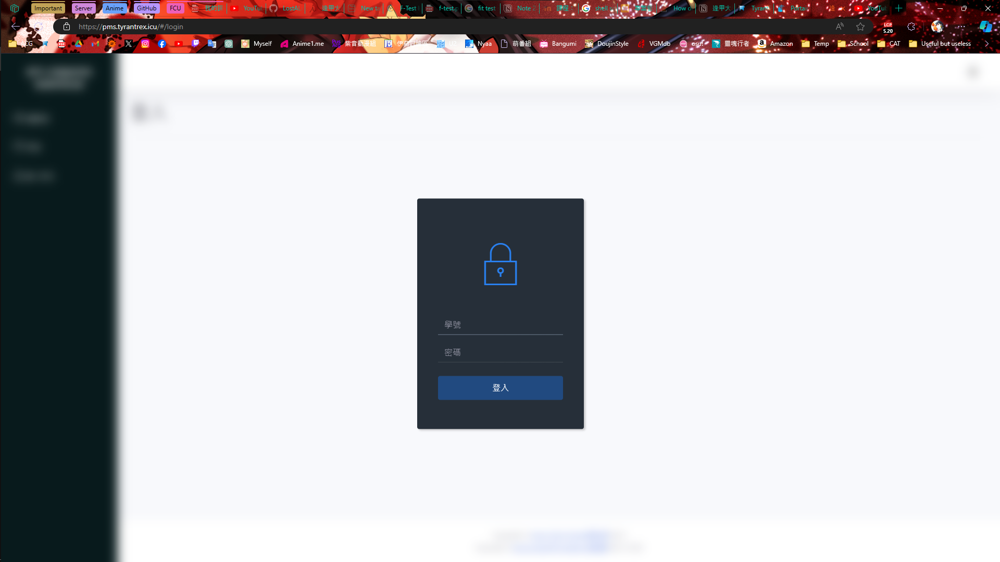

# 逢甲大學創能學院專題管理系統-使用者手冊

# 目錄

- [逢甲大學創能學院專題管理系統-使用者手冊](#逢甲大學創能學院專題管理系統-使用者手冊)
- [目錄](#目錄)
- [前言](#前言)
    - [關於本手冊](#關於本手冊)
    - [系統簡介](#系統簡介)
- [系統概覽](#系統概覽)
- [一般功能](#一般功能)
    - [儀表板](#儀表板)
    - [帳戶設定](#帳戶設定)
- [教授功能](#教授功能)
    - [專案頁面](#專案頁面)
    - [項目頁面](#項目頁面)
    - [公告頁面](#公告頁面)
    - [學生頁面](#學生頁面)
    - [教授頁面](#教授頁面)
    - [小組頁面](#小組頁面)
    - [作業頁面](#作業頁面)
- [學生功能](#學生功能)
    - [專案頁面](#專案頁面-1)
    - [項目頁面](#項目頁面-1)
    - [公告頁面](#公告頁面-1)
    - [學生頁面](#學生頁面-1)
    - [教授頁面](#教授頁面-1)
    - [小組頁面](#小組頁面-1)
    - [作業頁面](#作業頁面-1)
- [常見問題解答](#常見問題解答)

# 前言

### 關於本手冊

本手冊將提供您系統的詳細介紹、操作指南以及相關注意事項。請您仔細閱讀，以確保充分了解系統的各項功能和使用方式。若您在使用過程中遇到任何問題或有任何疑慮，請隨時參考本手冊或聯繫相關技術支援。

### 系統簡介

創能學院專題管理系統下稱 PMS 旨在提供學院師生一個集中管理、追蹤專題進度、促進合作的平台。系統具有直觀的用戶界面、豐富的功能模塊，並支持多種設備，以確保您能夠隨時隨地進行專題管理工作。

# 系統概覽

- 登入頁面

  - 身份驗證方式： 登入頁面使用學號及密碼進行身份驗證。請確保您輸入正確的學號和密碼，以免影響系統的正常使用。

  - 學號： 請輸入您的學號。學號是您在系統中獲得身份識別的唯一編號，確保輸入的學號是正確的，以免登入錯誤的帳戶。

  - 密碼： 輸入您的帳戶密碼。為了確保帳戶安全，請使用強密碼，結合字母、數字和符號，並避免使用容易猜測的密碼。

  - 安全性提醒： 請務必在使用完系統後登出，特別是在使用公共電腦時。這有助於確保您的帳戶不受未授權的訪問。

  

- 儀表板頁面

  - 專案概覽： 儀表板通常會列出所有相關專案的概要信息，例如進行中的專案數量、已完成的專案數量和進度概況。這能夠使用戶一目了然地瞭解整體情況。
  - 通知和提醒： 儀表板可能包含通知或提醒功能，以及時向用戶發送重要信息、截止日期或其他與專案相關的事件。
    

- 專案頁面

  - 基本信息： 專案頁面首先會列出基本的專案信息，包括專案名稱、編號、負責人等。這些基本信息能夠迅速讓使用者識別特定的專案。

  - 進度和狀態： 提供有關專案進展的信息，例如目前的階段、已完成的任務數量、開始和截止日期等。這有助於使用者瞭解專案的整體狀態。

  - 項目列表： 列舉專案中所有的任務和子任務，包括項目名稱、狀態和截止日期
    

- 個人資料

  - 基本資訊： 顯示用戶的基本資訊，如姓名、職位、部門等。這些信息有助於確保系統中的用戶資料是最新和正確的。

  - 聯絡信息： 提供用戶的聯絡方式，包括電子郵件地址、電話號碼等。確保這些資訊是準確的，以確保團隊內的有效溝通。

  - 密碼更改： 允許用戶更改其登入密碼。這是保障帳戶安全性的重要功能，用戶應該定期更新密碼。

  - 個人照片： 提供上傳或更換個人照片的選項，這有助於讓團隊成員更容易識別和聯繫對應的用戶。
    

    

- 登出頁面

  - 一個安全退出系統的方式
  - 點擊頭像

  

# 一般功能

### 儀表板

專案概覽： 儀表板通常會列出所有相關專案的概要信息，例如進行中的專案數量、已完成的專案數量和進度概況。這能夠使用戶一目了然地瞭解整體情況。

通知和提醒： 儀表板可能包含通知或提醒功能，以及時向用戶發送重要信息、截止日期或其他與專案相關的事件。

- 完成所有作業

  

- 有未完成的作業

  

### 帳戶設定

基本資訊： 用戶可以查看和編輯帳戶的基本資訊，包括姓名、職稱、部門等。確保這些資訊的正確性，以便系統中的相關信息是最新的。

聯絡方式： 提供用戶編輯和管理其聯絡方式的選項，包括電子郵件地址

在資料設定/個人資料中

- 更改圖片

  

  1. 選擇影像

  

  1. 儲存

  

  1. 重新整理頁面

     

- 更改電郵

  

  1. 輸入電子郵件

  

  1. 儲存
  2. 電郵更新成功

  

- 更改密碼

  

  1. 輸入舊密碼，新密碼及確認新密碼

  

  1. 儲存
  2. 系統會將您登出，使用新密碼登入

  

# 教授功能

### 專案頁面

基本信息： 在專案頁面列出了專案的基本信息，包括專案名稱等。這些基本信息有助於快速識別特定的專案。

進度和狀態： 提供了專案的進度狀態，例如已完成的任務數量、開始和截止日期等。這有助於用戶了解專案的整體狀態。

- 專案頁面

  

- 新增專案

  1. 單擊新增按鈕

     

  2. 填寫欄目

     

  3. 填寫完畢後按儲存

     

  4. 添加成功

     

- 刪除專案

  1. 點擊刪除按鈕

     

  2. 確定刪除項目

     

  3. 確認刪除

     

### 項目頁面

基本信息： 頁面頂部通常列出項目的基本信息，如項目名稱等

項目概要： 提供了對整個項目的總覽，包括項目的目標、範圍、時間表等

任務列表： 顯示與項目相關的所有任務和子任務，包括任務名稱、狀態和截止日期等

- 項目頁面

  

- 新增項目 (專案子項)

  1. 點擊專案

     

  2. 新增

     

  3. 填寫欄目

     

  4. 填寫完畢後按儲存

     

  5. 添加成功

     

- 刪除項目

  1. 點擊刪除按鈕

     

  2. 確定刪除項目

     

  3. 確認刪除

     

### 公告頁面

公告列表： 顯示了組織或專案的所有公告，按照發佈時間或重要性排序。每條公告通常包括標題、發佈日期和發佈者。

公告內容： 用戶可以點擊公告列表中的條目，以查看詳細內容。內容可能包括重要的事件、更新、計劃、或其他相關信息。

- 項目公告頁面

  

- 新增 公告

  1. 新增

     

  2. 填寫標題和內容然後儲存

     

     

  3. 完成新增

     

- 公告資訊

  1. 點擊標題

     

     

- 刪除公告

  1. 點擊刪除按鈕

     

  2. 確定刪除

     

### 學生頁面

基本信息： 顯示學生的基本信息，包括姓名、學號等。

- 管理項目中的學生頁面

- 學生資訊

  1. 點選學生名稱

     

  2. 顯示學生訊息

     

- 新增學生

  1. 點擊新增按鈕

     

  2. 新增學生

     - 從清單中選擇

       

       可以從清單中過濾或搜尋學生

       

     - 從 Excel 匯入

       導入前請仔細閱讀說明 格順序應如表所示

       

  3. 選擇完成後點選儲存

     

     

- 刪除學生

  1. 點擊刪除按鈕

     

  2. 確定刪除項目

     

### 教授頁面

基本信息： 顯示教授的基本信息，包括姓名等。

- 管理項目中的教授頁面

  

- 教授資訊

  1. 點選教授名稱

     

  2. 顯示教授訊息

     

- 新增教授

  1. 點擊新增按鈕

     

  2. 新增教授

     - 從清單中選擇

       

       可以從清單中過濾或搜尋教授

       

     - 從 Excel 匯入

       導入前請仔細閱讀說明格順序應如表所示

       

  3. 選擇完成後點選儲存

     

  4. 新增成功

     

- 刪除教授

  1. 點擊刪除按鈕

     

  2. 確定刪除項目

     

### 小組頁面

小組概要： 提供小組的基本概要，包括小組名稱、成員列表、小組負責人等信息

- 小組頁面

  

- 小組資訊

  1. 點選群組名稱

     

  2. 顯示群組訊息

     

- 新增小組

  1. 點擊新增

     

  2. 填寫小組名稱

     

  3. 從清單中選擇教授

     

  4. 從清單中選擇學生

     

  5. 選擇完成後點擊儲存

     

  1. 新增完成 重要:僅有小組成員會顯示在下表中

     

- 刪除小組

  1. 點擊刪除按鈕

     

  2. 確定刪除項目

     

### 作業頁面

作業列表： 列舉了所有與特定課程或項目相關的作業，包括作業標題、截止日期和分值。這有助於學生了解要完成的作業任務。

作業詳情： 提供每個作業的詳細信息，包括描述、提交要求、相關材料等。這使學生能夠清楚理解作業的要求。

作業提交： 學生可以在這個區域內提交作業，系統通常支援文檔上傳相關的提交方式。

評分： 一旦作業被提交，教師可以在這裡進行評分

- 作業頁面

  

- 作業 資訊

  1. 點選作業名稱

     

  2. 顯示群組訊息

     

- 新增作業

  1. 點擊新增

     

  2. 填寫相關欄目

     

     

  3. 選擇接受文件類型

     

     

  4. 從清單中選擇小組

     

     

  5. 選擇完成後點擊儲存
  6. 新增完成 重要:僅有小組成員會顯示在下表中

     

- 刪除作業

  1. 點擊刪除按鈕

     

  2. 確定刪除項目

     

- 上載作業

  1. 點擊選擇檔案或將檔案拖曳到此處

     

     

  2. 點擊上傳

     

  3. 上傳成功

     

- 下載已上載作業

  1. 點選作業名稱

     

  2. 點選檔案名稱

     

  3. 下載

     

- 刪除已上傳作業

  1. 點選作業名稱

     

  2. 點擊刪除按鈕

     

  3. 確定刪除項目

     

- 作業評分

  1. 點選作業名稱

     

  2. 點擊評分

     

  3. 輸入分數

     

  4. 確認

     

  5. 評分完成

     

# 學生功能

### 專案頁面

基本信息： 在專案頁面列出了專案的基本信息，包括專案名稱等。這些基本信息有助於快速識別特定的專案。

- 專案頁面

  

### 項目頁面

基本信息： 頁面頂部通常列出項目的基本信息，如項目名稱等

項目概要： 提供了對整個項目的總覽，包括項目的目標、範圍、時間表等

任務列表： 顯示與項目相關的所有任務和子任務，包括任務名稱、狀態和截止日期等

- 項目頁面

- 項目頁面

  

### 公告頁面

公告列表： 顯示了組織或專案的所有公告，按照發佈時間或重要性排序。每條公告通常包括標題、發佈日期和發佈者。

公告內容： 用戶可以點擊公告列表中的條目，以查看詳細內容。內容可能包括重要的事件、更新、計劃、或其他相關信息。

- 項目公告頁面

  

- 公告資訊

  1. 點擊標題

     

     

### 學生頁面

基本信息： 顯示學生的基本信息，包括姓名、學號等。

- 項目中的學生頁面

- 學生資訊

  1. 點選學生名稱

     

  2. 顯示學生訊息

     

### 教授頁面

基本信息： 顯示教授的基本信息，包括姓名等。

- 項目中的教授頁面

  

- 教授資訊

  1. 點選教授名稱

     

  2. 顯示教授訊息

     

### 小組頁面

小組概要： 提供小組的基本概要，包括小組名稱、成員列表、小組負責人等信息

- 小組頁面

  

- 小組資訊

  1. 點選群組名稱

     

  2. 顯示群組訊息

     

### 作業頁面

作業列表： 列舉了所有與特定課程或項目相關的作業，包括作業標題、截止日期和分值。這有助於學生了解要完成的作業任務。

作業詳情： 提供每個作業的詳細信息，包括描述、提交要求、相關材料等。這使學生能夠清楚理解作業的要求。

作業提交： 學生可以在這個區域內提交作業，系統通常支援文檔上傳相關的提交方式。

評分： 一旦作業被提交，教師可以在這裡進行評分

- 作業頁面

  

- 作業資訊

  1. 點選作業名稱

     

  2. 顯示群組訊息

     

- 上載作業

  1. 點擊選擇檔案或將檔案拖曳到此處

     

     

  2. 點擊上傳

     

  3. 上傳成功

     

- 刪除已上傳作業

  1. 點選作業名稱

     

  2. 點擊刪除按鈕

     

  3. 確定刪除項目

     

- 下載已上載作業

  1. 點選作業名稱

     

  2. 點選檔案名稱

     

  3. 下載

     

# 常見問題解答

- 刷新解決 87% 問題

